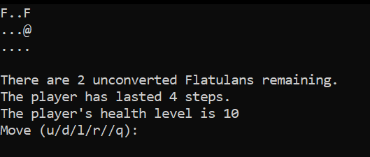

# Gas

## Brief Intro

A Pac-Man like game.

## Rules

On a 8*8 board (city), there are multiple Flatulans (indicated by `F` or a number) and a player (indicated by a `@`).

For the Flatulans, they will move in a random direction each turn; and will blast the player if they are orthogonally adjacent, causing the player to lose HP.

For each turn, the player can take one of these actions:

1. Move one step up, down, left, or right to an empty position (i.e., one not occupied by a Flatulan). If the player attempts to move into the wall of the city (e.g., down, when on the bottom row) or to a position occupied by a Flatulan, the player does not move.
2. Preach to the Flatulans adjacent to the player orthogonally or diagonally (i.e., to any Flatulans next to the player in the eight directions). For each of those Flatulans, there is a 2/3 probability that the player will convert that Flatulan to no longer pollute the air.

The player initially has 12 HP. The game ends when the player's HP becomes 0, or all Flatulans as been converted.

## Extensions to the original program

Rewrite program in C# and use WPF to convert to a GUI version. This also enables listening to keystrokes instead of manually input which direction to go or action to take.

(Now the red square represent the player, and Flatulans are indicated by numbers in the square.)

## Background

(From class [website](https://web.cs.ucla.edu/classes/fall20/cs31/Projects/7/spec.html), archive [here](https://web.archive.org/web/20201205070755/https://web.cs.ucla.edu/classes/fall20/cs31/Projects/7/spec.html))

You have arrived in the walled city of Flatula, whose residents eat beans, cabbage, and hard-boiled eggs with every meal. Although they are used to the resulting effects, the odor that emanates from the Flatulans you encounter makes you woozy. Your only hope to keep from passing out is to successfully preach to the Flatulans about converting to a diet of lean meat, lettuce, and rice.

On the board the player (indicated by `@`) in a rectangular city filled with Flatulans (usually indicated by `F`). At each turn, the user will select an action for the player to take. The player will take the action, and then each Flatulan will move one step in a random direction. The attempt to move will make each Flatulan break wind. If the Flatulan is orthogonally adjacent to the player, the player is affected by the blast of gas. If the player suffers twelve such blasts during the game, the player passes out and the game is over.

Each move, you, the player may:

- Move one step up, down, left, or right to an empty position (i.e., one not occupied by a Flatulan). If the player attempts to move into the wall of the city (e.g., down, when on the bottom row) or to a position occupied by a Flatulan, the player does not move.
- Preach to the Flatulans adjacent to the player orthogonally or diagonally (i.e., to any Flatulans next to the player in the eight directions). For each of those Flatulans, there is a 2/3 probability that the player will convert that Flatulan to no longer pollute the air. A Flatulan who has been converted should be removed from the game, since they pose no further threat to the player and are thus irrelevant.

The game allows the user to select the player's action by typing u/d/l/r for moving or just hitting enter for preaching. The user may also type q to prematurely quit the game.

When it's the Flatulans' turn, each Flatulan picks a random direction (up, down, left, or right) with equal probability. The Flatulan moves one step in that direction if it can; however, if doing so would cause the Flatulan to move into a wall of the city (e.g., down, when on the bottom row) or to the position occupied by the player, it does not move. More than one Flatulan may occupy the same position; in that case, instead of `F`, the display will show a digit character indicating the number of Flatulans at that position (where `9` indicates 9 or more). After each Flatulan attempts to move (even if it doesn't actually move), if it is now orthogonally adjacent to the player (i.e., next to the player directly above, below, to the left, or to the right, but not diagonally), the player suffers one blast of gas from that Flatulan. If this is the twelfth gas blast the player has suffered during the game, the player passes out and the game is over.